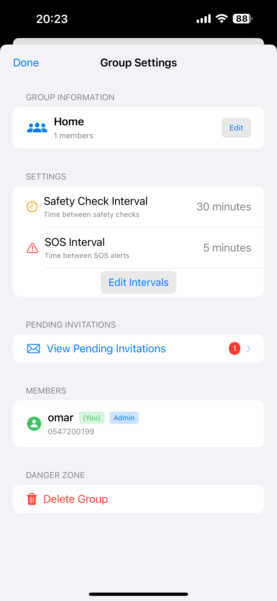
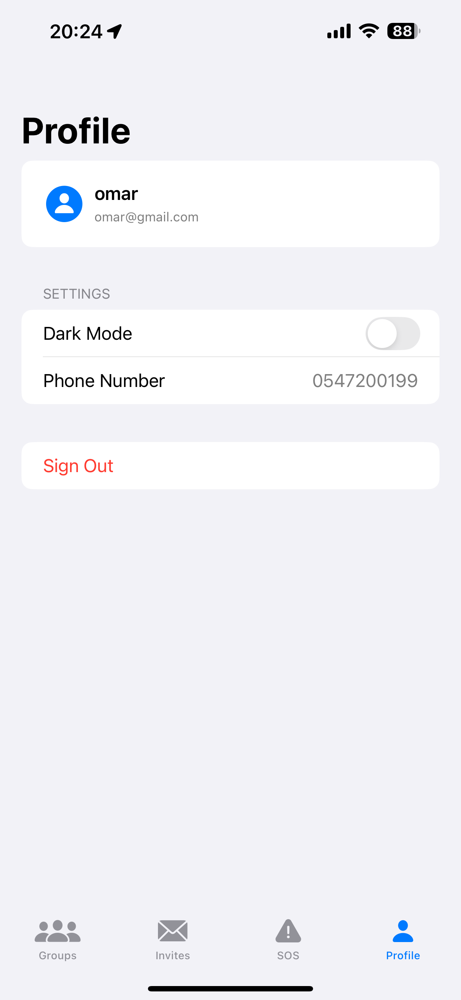

# SOSync - Emergency Safety Group App

<p align="center">
  
</p>

<p align="center">
  <strong>Stay Connected, Stay Safe</strong><br>
  A real-time iOS safety monitoring app that helps groups stay connected during emergencies
</p>

<p align="center">
  
  
  
  
  
</p>

## 📱 About SOSync

SOSync (SOS + Sync) is an iOS application designed to keep groups of people connected and safe during emergencies. Whether you're organizing outdoor activities, managing a team in hazardous conditions, or simply want to ensure your family's safety, SOSync provides real-time safety monitoring and emergency alerts.

## ✨ Key Features

### 🚨 Emergency SOS System
- **One-tap SOS alerts** to notify all group members instantly
- **Automatic location sharing** when SOS is triggered
- **Emergency contact display** with direct calling capability
- **Navigate directly** to member's location in Maps
- **SOS to all groups** or specific group selection
- **Admin controls** to cancel false/outdated alarms (after 24-hour safety period)

### 🛡️ Safety Check System
- **Group-wide safety checks** initiated by members
- **Push notifications** for immediate response
- **Real-time status tracking**: Safe / SOS / Pending
- **Automatic group status updates**: Normal / Checking / All Safe / Emergency
- **Visual progress indicators** showing response rates

### 👥 Group Management
- **Create unlimited safety groups** for different contexts
- **Invite members** via @username or phone number search
- **Admin controls** for group settings and member management
- **Customizable intervals**:
  - Safety check cooldown
  - SOS alert cooldown
- **Leave groups** anytime as a member
- **Delete groups** as admin with full cleanup

### 🔔 Real-time Features
- **Firebase Realtime Database** for instant updates
- **Push notifications** for all critical events
- **Badge count** for pending invitations
- **Live status updates** across all devices

### 🎨 User Experience
- **Dark/Light mode** support with system integration
- **Clean, intuitive interface** following iOS design guidelines
- **Loading states** and error handling
- **Pull-to-refresh** on all list views

## 📸 Screenshots

<p align="center">
    
    
    
    
    
    
    
    
    
    
    
    
    
    
    
    
    
    
    
    
    
    
    
    
</p>

## 🛠️ Technical Architecture

### Design Pattern
- **MVVM Architecture** for clean separation of concerns
- **SwiftUI** for declarative UI
- **Combine** for reactive programming
- **Async/Await** for modern concurrency

### Backend Services
- **Firebase Authentication** for secure user management
- **Firebase Realtime Database** for live data sync
- **Firebase Cloud Messaging** for push notifications
- **CoreLocation** for GPS tracking

## 📋 Requirements

- iOS 15.0 or later
- iPhone with GPS capability
- Internet connection (WiFi or Cellular)
- Firebase account for backend services
- Apple Developer account for push notifications

## 🚀 Installation

### Prerequisites
1. Xcode 15.0 or later
2. CocoaPods or Swift Package Manager
3. Firebase project with required services enabled

### Setup Steps

1. **Clone the repository**
   ```bash
   git clone https://github.com/islamsaadi/SOSync.git
   cd SOSync
   ```

2. **Install dependencies**
   ```bash
   # If using CocoaPods
   pod install
   
   # Open the workspace
   open SOSync.xcworkspace
   ```

3. **Configure Firebase**
   - Create a new Firebase project at [Firebase Console](https://console.firebase.google.com)
   - Add an iOS app with your bundle identifier
   - Download `GoogleService-Info.plist`
   - Add it to the Xcode project (drag to project navigator)
   - Enable these Firebase services:
     - Authentication (Email/Password)
     - Realtime Database
     - Cloud Messaging

4. **Set up Firebase Database Rules**
   ```json
   {
     "rules": {
       ....
     }
   }
   ```

5. **Configure Push Notifications**
   - Enable Push Notifications capability in Xcode
   - Create APNs key in Apple Developer Console
   - Upload APNs key to Firebase Console
   - Configure notification entitlements

6. **Update Bundle Identifier**
   - Select project in Xcode
   - Change bundle identifier to your own
   - Update in Firebase project settings

7. **Build and Run**
   ```bash
   # Select your target device/simulator
   # Press Cmd+R to build and run
   ```

## 🔧 Configuration

### App Configuration
- Update `Info.plist` with your app details
- Configure privacy descriptions for location and notifications
- Set up proper app capabilities

### Firebase Configuration
- Adjust database rules based on your security needs
- Configure Cloud Functions for advanced notifications (optional)


## 📄 License

This project is licensed under the MIT License.

## 🆘 Support & Contact

- **Issues**: [GitHub Issues](https://github.com/islamsaadi/SOSync/issues)
- **Email**: issaadi0@gmail.com

---

<p align="center">
  Made with ❤️ for keeping people safe
  <br>
  <a href="https://github.com/islamsaadi/SOSync">View on GitHub</a>
</p>